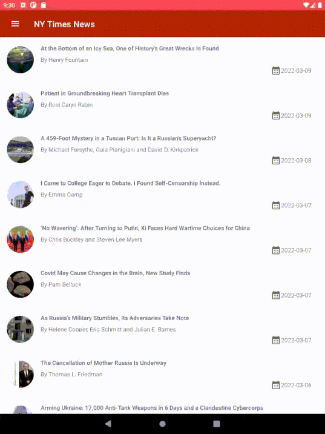

# Popular News

Popular News is an Android application consuming the [NY Times API](https://developer.nytimes.com/) 
to display most popular news over the last 7 days. The app follows clean architecture principles 
and uses MVVM with the Android architecture components.

## Demo

Mobile            |  Tablet
:-------------------------:|:-------------------------:
  |  
  |  
  |  


## Project Setup

1. Clone the repo using ```git clone https://github.com/tonyawino/News-App.git```
1. Open the project in Android Studio
1. Generate a [NY Times API Key](https://developer.nytimes.com/get-started) 
1. Add the API Key to your local `gradle.properties` file with the key `NY_TIMES_API_KEY` 
    and the value of your API Key e.g `NY_TIMES_API_KEY="cjCe8546151551894561s"`
1. Sync and build your project.
1. Hit "Run". Done!
## Architecture Overview

The application has three layers guided by clean architecture to provide clear 
separation of concerns:


### UI

The `ui` package has files that make up the interface i.e. activities and fragments. 
ViewModels are also contained in this package and they are used to handle the states 
of the views, which is exposed using LiveData. Additionally, the ViewModels also 
act as an interface of communicating with the other layers.

### Domain

The `domain` package has the domain models/entities that represent data to be handled 
across the whole app i.e. from the UI to the data layer. The layer also contains 
use cases that represent various actions that can be performed for data transfer 
between the data and UI layers. A repository interface is also in the domain layer, 
and it defines a contract to be followed by any repository implementation. 

### Data

The `data` layer is divided into two data sources, local and remote. The two data 
sources collaborate to have a single source of truth, which is the local layer. 
The remote source is in the `retrofit` package and is used to communicate with the 
remote server, while the local source is in the `room` package. The repository maps 
data from these two sources into the required domain models.

#### Helpers

Packages used to tie the whole setup together include `di` for dependency injection 
and `utils` which contains some shared utilities.
## Testing

Most packages, and files, have their own tests, with exceptions such as the dependency 
injection files.  

Server responses are mocked and verified for correctness. The local 
database is tested using an in-memory database that is faster than an actual database 
and only lasts the duraction of the test.  

Use cases are also tested for correctness and validation of data.

ViewModels were also tested for correctness using the UseCases and the repository with 
a mock webserver and an in-momory database.

The instrumentation tests use a mocked context and a mocked server. This is to test 
various scenarios including the unavailability of internet. 

### Running the tests

The application contains unit tests that run on the local machine and instrumented tests that 
require the use of an emulator or connected Android device. 

1. Run the task `./gradlew connectedCheck` to run both local unit tests and instrumented tests
1. Run the task `./gradlew test` for local unit tests
1. Locate the test coverage results at `/app/build/reports/coverage/androidTest/debug`
1. Locate the local unit test results at
    - HTML test result files at `/app/build/reports/tests/`
    - XML test result files at `/app/build/test-results/`
1. Locate the instrumented test results at
    - HTML test result files at `/app/build/reports/androidTests/connected/`
    - XML test result files at `/app/build/outputs/androidTest-results/connected/`
## Libraries

 
Libraries used in the whole application are:

- [Jetpack](https://developer.android.com/jetpack)🚀
  - [Viewmodel](https://developer.android.com/topic/libraries/architecture/viewmodel) - Manage UI related data in a lifecycle conscious way 
    and act as a channel between use cases and ui
  - [View Binding](https://developer.android.com/topic/libraries/data-binding) - View binding is a feature that allows you to more easily write code that interacts with views
  - [Room](https://developer.android.com/training/data-storage/room) - Provides abstraction layer over SQLite
  - [Navigation Components](https://developer.android.com/guide/navigation/navigation-getting-started) - Navigation support for Android
- [Retrofit](https://square.github.io/retrofit/) - type safe http client and supports coroutines out of the box
- [Gson](https://github.com/square/moshi) - Library that can be used to convert Kotlin Objects into/from their JSON representation
- [okhttp-logging-interceptor](https://github.com/square/okhttp/blob/master/okhttp-logging-interceptor/README.md) - logs HTTP request and response data.
- [Coroutines](https://kotlinlang.org/docs/reference/coroutines-overview.html) - Threads on steroids for Kotlin 
- [Flow](https://kotlin.github.io/kotlinx.coroutines/kotlinx-coroutines-core/kotlinx.coroutines.flow/-flow/) - A cold asynchronous data stream that sequentially emits values and completes normally or with an exception. 
- [Truth](https://truth.dev/) - Assertions Library,provides readability as far as assertions are concerned
- [Material Design](https://material.io/develop/android/docs/getting-started/) - build awesome beautiful UIs.🔥🔥
- [Espresso](https://developer.android.com/training/testing/espresso) - Test framework to write UI Tests
- [mockK](https://mockk.io/) - Mocking framework that comprehensively supports Kotlin features
- [JUnit Rules](https://developer.android.com/training/testing/instrumented-tests/androidx-test-libraries/rules) - JUnit rules provide more flexibility and reduce the boilerplate code required in tests
- [Glide](https://github.com/bumptech/glide) - Media management and image loading framework for Android 
- [Hilt-Dagger](https://dagger.dev/hilt/) - Standard library to incorporate Dagger dependency injection into an Android application.
- [Hilt-ViewModel](https://developer.android.com/training/dependency-injection/hilt-jetpack) - DI for injecting `ViewModel`.
## Copyright Notice

New York Times and all associated names are copyright [The New York Times Company](https://developer.nytimes.com/terms).
## License

[GPL v3](https://opensource.org/licenses/GPL-3.0)

    News App is an Android application displaying popular news using the NY Times API. 
    Copyright (C) 2022  Tony Awino

    This program is free software: you can redistribute it and/or modify
    it under the terms of the GNU General Public License as published by
    the Free Software Foundation, either version 3 of the License, or
    (at your option) any later version.

    This program is distributed in the hope that it will be useful,
    but WITHOUT ANY WARRANTY; without even the implied warranty of
    MERCHANTABILITY or FITNESS FOR A PARTICULAR PURPOSE.  See the
    GNU General Public License for more details.

    You should have received a copy of the GNU General Public License
    along with this program.  If not, see <http://www.gnu.org/licenses/>.
